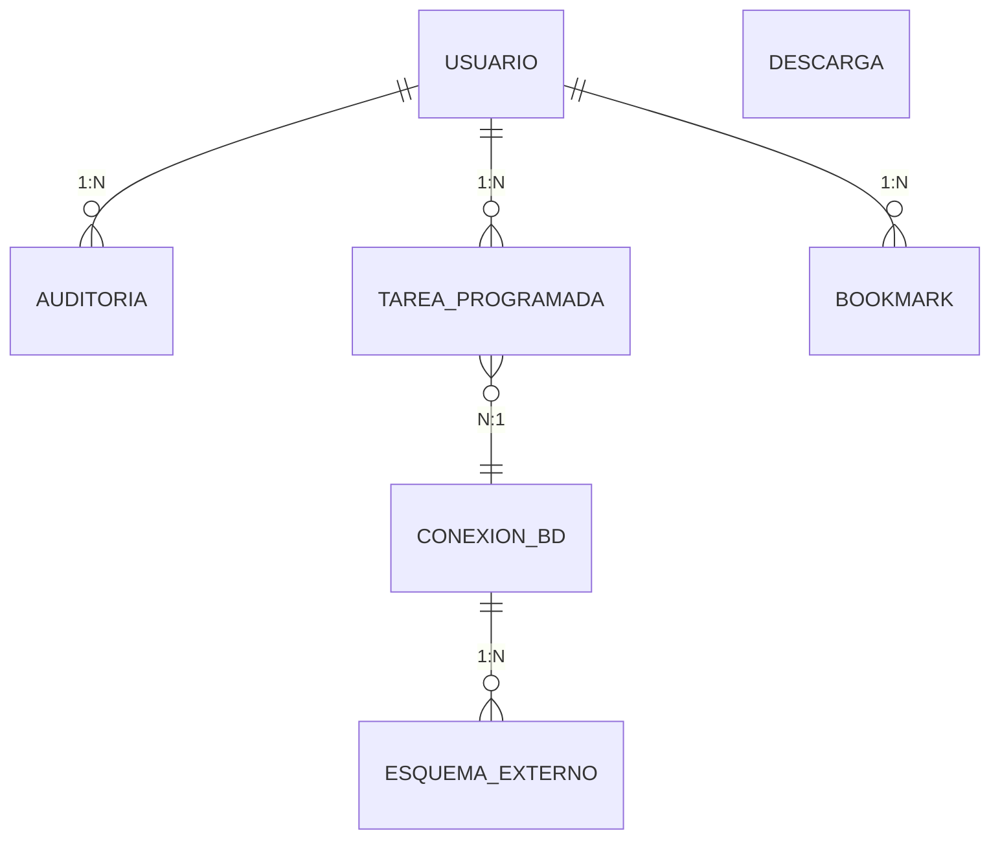

UNIVERSIDAD PRIVADA DE TACNA

FACULTAD DE INGENIERÍA

Escuela Profesional de Ingeniería de Sistemas

Proyecto Administrador de BD en consola o terminal

Curso: Base de Datos II

Docente: Patrick Cuadros Quiroga

Integrantes:

Jahuira Pilco, Dayan Elvis  (2022075749)

Mamani Cori, Cristhian Carlos  (2023077282)

Tacna – Perú

2026

---

## CONTROL DE VERSIONES

| Versión | Hecha por | Revisada por | Aprobada por | Fecha | Motivo |
| --- | --- | --- | --- | --- | --- |
| 1.0 | DJ - CM | PCQ | PCQ | 26/04/2026 | Versión Original |
| 2.0 | DJ - CM | PCQ | PCQ | 06/06/2026 | Versión 2.0 |
| 3.0 | DJ - CM | PCQ | PCQ | 06/07/2026 | Versión Final |

Sistema Administrador de BD en consola o terminal

Documento de diccionario de datos

Versión 3.0

---

## ÍNDICE GENERAL

1. [Introducción](#introducción)
2. [Modelo lógico](#1-modelo-lógico)
3. [Diccionario de datos](#2-diccionario-de-datos)
   - a. Tabla Usuario
   - b. Tabla Auditoria
   - c. Tabla Tarea_programada
   - d. Tabla Bookmark
   - e. Tabla Descarga
   - f. Tabla Conexion_bd
   - g. Tabla Esquema_externo
4. [Relaciones entre entidades](#3-relaciones-entre-entidades)
5. [Reglas de negocio](#4-reglas-de-negocio)
   - a. Gestión de Usuarios y Roles
   - b. Gestión de Conexiones y Motores de Base de Datos
   - c. Gestión de Tareas Programadas
   - d. Gestión de Bookmarks y Consultas
   - e. Gestión de Analítica y Descargas
6. [Objetos de la Base de Datos](#5-objetos-de-la-base-de-datos)
7. [Conclusiones](#6-conclusiones)
8. [Recomendaciones](#7-recomendaciones)
9. [Bibliografía](#8-bibliografía)

---

## Introducción

El presente documento constituye el **Diccionario de Datos** del proyecto *Administrador de BD en consola o terminal (NexusDB)*, desarrollado en el marco del curso de Base de Datos II de la Escuela Profesional de Ingeniería de Sistemas de la Universidad Privada de Tacna. Su propósito es describir de manera formal y detallada las estructuras de información que administra el sistema, incluyendo entidades, atributos, tipos de dato, restricciones y relaciones, con el fin de dejar constancia técnica de cómo se organiza y persiste la información dentro de la aplicación.

A diferencia de un sistema tradicional con una base de datos propia y centralizada, NexusDB fue concebido como una **herramienta cliente e intermediaria**, capaz de conectarse, administrar y ejecutar consultas sobre múltiples motores de bases de datos externos —SQLite, MySQL, PostgreSQL, MongoDB, Redis y Cassandra— desde una única interfaz de consola. Por esta razón, el presente diccionario documenta principalmente las estructuras internas de soporte de la aplicación (usuarios, tareas programadas, bookmarks, auditoría y analítica de descargas), y no un esquema relacional propio de gran escala.

A lo largo del documento se detallan las tablas y entidades identificadas, sus campos con la descripción, tipo de dato, longitud y restricciones correspondientes, así como las relaciones existentes entre ellas expresadas mediante su cardinalidad (1:N, N:1, entre otras). Asimismo, se aclara explícitamente qué elementos típicos de un diccionario de datos —como procedimientos almacenados, triggers y eventos de base de datos— no aplican al proyecto, justificando el motivo arquitectónico de dicha ausencia.

Finalmente, este documento busca servir como referencia técnica tanto para el equipo de desarrollo como para futuras iteraciones del proyecto, facilitando el mantenimiento del sistema actual y sentando las bases para una eventual evolución hacia un modelo de persistencia más robusto, en caso de que el proyecto requiera escalar sus capacidades de almacenamiento y trazabilidad.

---

## 1. Modelo lógico

En esta sección se muestra el modelo lógico de la base de datos representado mediante un diagrama Entidad-Relación (DER).

| Relación | Cardinalidad |
|---|---|
| USUARIO → AUDITORIA | 1:N |
| USUARIO → TAREA_PROGRAMADA | 1:N |
| USUARIO → BOOKMARK | 1:N |
| TAREA_PROGRAMADA → CONEXION_BD | N:1 |
| CONEXION_BD → ESQUEMA_EXTERNO | 1:N |
| DESCARGA | 0 (entidad independiente) |

---

## 2. Diccionario de datos

### a. Tabla Usuario

| Campo | Descripción | Tipo de Dato | Longitud | Restricciones |
|---|---|---|---|---|
| nombre | Nombre de usuario (login) | VARCHAR | 50 | PK, NOT NULL |
| password_hash | Hash SHA-256 de la contraseña | VARCHAR | 64 | NOT NULL |
| rol | Rol asignado (admin, operador, etc.) | VARCHAR | 20 | NOT NULL |
| creado | Fecha y hora de creación del usuario | DATETIME | - | NOT NULL |

### b. Tabla Auditoria

| Campo | Descripción | Tipo de Dato | Longitud | Restricciones |
|---|---|---|---|---|
| id | Identificador de auditoría | INT | 11 | PK, NOT NULL |
| usuario | Usuario que ejecutó la acción | VARCHAR | 50 | FK, NOT NULL |
| accion | Descripción de la acción realizada | VARCHAR | 255 | NOT NULL |

### c. Tabla Tarea_programada

| Campo | Descripción | Tipo de Dato | Longitud | Restricciones |
|---|---|---|---|---|
| id | Identificador de la tarea | INT | 11 | PK, NOT NULL |
| usuario | Usuario que creó la tarea | VARCHAR | 50 | FK, NOT NULL |
| comando | Comando SQL a ejecutar | VARCHAR | 500 | NOT NULL |

### d. Tabla Bookmark

| Campo | Descripción | Tipo de Dato | Longitud | Restricciones |
|---|---|---|---|---|
| alias | Nombre corto asignado a la consulta | VARCHAR | 50 | PK, NOT NULL |
| usuario | Usuario propietario del bookmark | VARCHAR | 50 | FK, NOT NULL |
| sql_query | Consulta SQL guardada | VARCHAR | 500 | NOT NULL |

### e. Tabla Descarga

| Campo | Descripción | Tipo de Dato | Longitud | Restricciones |
|---|---|---|---|---|
| id | Identificador de descarga | INT | 11 | PK, NOT NULL |
| ip | Dirección IP del solicitante | VARCHAR | 15 | NOT NULL |
| file_name | Nombre del archivo descargado | VARCHAR | 100 | NOT NULL |

### f. Tabla Conexion_bd

| Campo | Descripción | Tipo de Dato | Longitud | Restricciones |
|---|---|---|---|---|
| tipo_motor | Motor de base de datos externo | VARCHAR | 20 | PK, NOT NULL |
| host | Dirección del servidor de BD | VARCHAR | 100 | NOT NULL |
| estado | Estado actual de la conexión | VARCHAR | 20 | NOT NULL |

### g. Tabla Esquema_externo

| Campo | Descripción | Tipo de Dato | Longitud | Restricciones |
|---|---|---|---|---|
| nombre_tabla | Nombre de la tabla introspectada | VARCHAR | 100 | PK, NOT NULL |
| tipo_motor | Motor de BD al que pertenece | VARCHAR | 20 | FK, NOT NULL |
| nombre_columna | Nombre de la columna detectada | VARCHAR | 100 | PK, NOT NULL |

---

## 3. Relaciones entre entidades

- Un **usuario** puede tener uno o varios **bookmarks** guardados, para reutilizar consultas SQL frecuentes.
- Un **usuario** puede crear una o varias **tareas programadas**, que se ejecutan automáticamente sobre una **conexión de base de datos**.
- Un **usuario** genera uno o varios registros de **auditoría**, que documentan sus acciones dentro del sistema (login, logout, comandos ejecutados).
- Una **tarea programada** se ejecuta sobre una **conexión de base de datos**, indicando el motor externo (SQLite, MySQL, PostgreSQL, MongoDB, Redis o Cassandra) donde correrá el comando.
- Una **conexión de base de datos** expone uno o varios registros de **esquema externo**, correspondientes a las tablas y columnas detectadas por introspección en el motor conectado.
- Una **descarga** registra el acceso de un visitante (IP, navegador y archivo descargado) desde el sitio del proyecto, sin estar vinculada directamente a un usuario del sistema.

---

## 4. Reglas de negocio

### a. Gestión de Usuarios y Roles

- Un usuario solo puede tener un rol a la vez (`admin` u otro rol definido en el sistema de permisos).
- Solo un usuario con rol `admin` puede listar, agregar o gestionar otros usuarios.
- Toda contraseña se almacena como hash (nunca en texto plano) antes de guardarse en `usuarios.json`.
- Cada acción relevante del usuario (login, logout, intento fallido) queda registrada en el log de auditoría.
- Un usuario sin sesión iniciada no puede ejecutar comandos que requieran permisos según el rol.

### b. Gestión de Conexiones y Motores de Base de Datos

- El sistema no posee un motor de base de datos propio; toda consulta se ejecuta contra un motor externo (SQLite, MySQL, PostgreSQL, MongoDB, Redis o Cassandra).
- Antes de ejecutar cualquier comando, debe existir una conexión activa establecida hacia el motor correspondiente.
- El tipo de conector a utilizar se determina automáticamente mediante el detector de base de datos (`DetectorBaseDatos`).
- El esquema externo (tablas y columnas) se obtiene siempre por introspección en tiempo real, nunca se asume ni se cachea de forma permanente.

### c. Gestión de Tareas Programadas

- Cada tarea programada debe estar vinculada a un usuario que la creó y a un comando SQL válido.
- Una tarea puede programarse en modalidad única (`at`, a una hora específica) o recurrente (`every`, cada N horas).
- Una tarea inactiva (`activa = false`) no se ejecuta aunque su hora programada se cumpla.
- El motor de tareas se ejecuta en un hilo independiente y no bloquea el uso interactivo del REPL.

### d. Gestión de Bookmarks y Consultas

- Un alias de bookmark es único; no pueden coexistir dos consultas guardadas con el mismo alias.
- Solo el usuario propietario puede eliminar o sobrescribir su propio bookmark.

### e. Gestión de Analítica y Descargas

- Cada descarga del instalador o binario registra IP, user-agent, archivo y fecha, independientemente de si el usuario está autenticado en el sistema.
- El registro de descargas es de solo escritura desde la aplicación (no se edita ni elimina manualmente).

---

## 5. Objetos de la Base de Datos

El sistema *NexusDB / Administrador de BD en consola* no implementa procedimientos almacenados, triggers ni eventos a nivel de motor de base de datos. Esto se debe a que la aplicación no administra un esquema de base de datos propio, sino que actúa como un **cliente intermediario** que se conecta a motores externos (SQLite, MySQL, PostgreSQL, MongoDB, Redis y Cassandra) definidos por el usuario final. La única base de datos gestionada directamente por el sistema (`analytics.sqlite3`) se limita a una tabla de registro de descargas (`downloads`), sin lógica embebida en el motor. Las validaciones y automatizaciones del sistema (autenticación, control de permisos, auditoría de acciones y ejecución de tareas programadas) se implementan a nivel de aplicación, en código Python, y no como objetos del motor de base de datos.

---

## 6. CONCLUSIONES

1. El sistema **Administrador de BD en consola (NexusDB)** no posee un motor de base de datos propio; funciona como una capa cliente/intermediaria que se conecta e interactúa con motores externos (SQLite, MySQL, PostgreSQL, MongoDB, Redis y Cassandra), por lo que su "base de datos" real es reducida y de soporte, no el núcleo del sistema.

2. Las estructuras de datos internas del sistema (`usuarios.json`, `tareas.json`, bookmarks, log de auditoría) se implementan como archivos JSON y de texto plano, no como tablas de un motor relacional, lo cual simplifica el despliegue pero limita las garantías de integridad referencial que ofrecería un DBMS tradicional.

3. La única base de datos relacional gestionada directamente por el sistema (`analytics.sqlite3`) es mínima, con una sola tabla (`downloads`), enfocada exclusivamente en analítica de uso (descargas del instalador), sin relación con la lógica funcional del CLI.

4. Al no existir un esquema propio con procedimientos almacenados, triggers o eventos, toda la automatización (autenticación, verificación de permisos, auditoría y ejecución de tareas programadas) recae en la capa de aplicación (Python), lo que hace que la robustez del sistema dependa del código y no de mecanismos nativos del motor de base de datos.

5. El diccionario de datos elaborado permite documentar de forma clara qué información gestiona el sistema y cómo se relaciona, sirviendo como base para una eventual migración hacia un modelo de datos persistente y relacional si el proyecto escalara (por ejemplo, mover usuarios, tareas y bookmarks a tablas SQL reales con sus respectivas restricciones e integridad referencial).

6. En conjunto, el análisis confirma que el valor del sistema no está en la complejidad de su propia base de datos, sino en su capacidad de actuar como una herramienta unificada de administración sobre múltiples motores de bases de datos heterogéneos.

---

## 7. RECOMENDACIONES

1. **Migrar las estructuras internas a un motor relacional real.** Reemplazar `usuarios.json`, `tareas.json` y los bookmarks (actualmente archivos planos) por tablas en SQLite o PostgreSQL, con llaves primarias, foráneas y restricciones (`NOT NULL`, `UNIQUE`), para ganar integridad referencial y evitar corrupción de datos por escritura concurrente.

2. **Cifrar y proteger mejor las credenciales.** Aunque las contraseñas se almacenan como hash, se recomienda migrar de un hash simple a un algoritmo con salt y factor de costo (bcrypt, argon2 o scrypt), y evitar guardar las credenciales de conexión a motores externos en texto plano.

3. **Formalizar el log de auditoría como tabla de base de datos.** Actualmente `audit.log` es un archivo de texto; convertirlo en una tabla (`auditoria`) permitiría consultas estructuradas, filtrado por usuario/fecha y generación de reportes de seguridad.

4. **Implementar respaldos (backups) automáticos** de `analytics.sqlite3` y de los archivos JSON críticos, dado que actualmente no hay un mecanismo de recuperación ante pérdida o corrupción de estos archivos.

5. **Definir políticas de expiración y bloqueo de sesión** más robustas (actualmente el control de intentos fallidos es básico), incluyendo bloqueo temporal tras N intentos fallidos y expiración de sesión por inactividad.

6. **Documentar y versionar el esquema de `analytics.sqlite3`** mediante migraciones (por ejemplo con Alembic o scripts SQL versionados), para que los cambios futuros a esa tabla queden trazados.

7. **Evaluar la necesidad real de procedimientos almacenados/triggers** solo si el sistema evoluciona a administrar su propia base de datos persistente; mientras siga siendo un cliente intermediario, mantener la lógica en la capa de aplicación es la opción más simple y mantenible.

8. **Estandarizar el diccionario de datos** como documento vivo: actualizarlo cada vez que se agregue un nuevo campo o entidad (por ejemplo, si se añaden nuevas features con persistencia propia), para que no quede desactualizado respecto al código.

---

## 8. BIBLIOGRAFÍA

- Elmasri, R. & Navathe, S. (2016). *Fundamentals of Database Systems*. 7th Edition. Pearson.
- Date, C. J. (2004). *An Introduction to Database Systems*. Addison-Wesley.
- Coronel, C. & Morris, S. (2017). *Database Systems: Design, Implementation, and Management*. Cengage Learning.
