UNIVERSIDAD PRIVADA DE TACNA

FACULTAD DE INGENIERÍA

Escuela Profesional de Ingeniería de Sistemas

Proyecto Administrador de BD en consola o terminal

Curso: Base de Datos II

Docente: Patrick Cuadros Quiroga

Integrantes:

Jahuira Pilco, Dayan Elvis					(2022075749)

Mamani Cori, Cristhian Carlos				(2023077282)

Tacna – Perú

2026

| CONTROL DE VERSIONES | CONTROL DE VERSIONES | CONTROL DE VERSIONES | CONTROL DE VERSIONES | CONTROL DE VERSIONES | CONTROL DE VERSIONES |
| --- | --- | --- | --- | --- | --- |
| Versión | Hecha por | Revisada por | Aprobada por | Fecha | Motivo |
| 1.0 | DJ - CM | PCQ | PCQ | 26/04/2026 | Versión Original |
| 2.0 | DJ - CM | PCQ | PCQ | 06/06/2026 | Versión 2.0 |
| 3.0 | DJ - CM | PCQ | PCQ | 06/07/2026 | Versión Final |

# Sistema {Nombre del Sistema}

# Documento de Especificación de Requerimientos de Software

# Versión 3.0

| CONTROL DE VERSIONES | CONTROL DE VERSIONES | CONTROL DE VERSIONES | CONTROL DE VERSIONES | CONTROL DE VERSIONES | CONTROL DE VERSIONES |
| --- | --- | --- | --- | --- | --- |
| Versión | Hecha por | Revisada por | Aprobada por | Fecha | Motivo |
| 1.0 | DJ - CM | PCQ | PCQ | 26/04/2026 | Versión Original |
| 2.0 | DJ - CM | PCQ | PCQ | 06/06/2026 | Versión 2.0 |
| 3.0 | DJ - CM | PCQ | PCQ | 06/07/2026 | Versión Final |

INDICE GENERAL

Informe de SRS

# Generalidades de la Empresa

## Nombre de la Empresa

Aegis Filter

## Vision

Ser un equipo capaz de desarrollar soluciones de software funcionales, aplicando buenas prácticas de ingeniería y contribuyendo al aprendizaje tecnológico.

## Mision

Desarrollar aplicaciones de software que cumplan con los requerimientos establecidos, aplicando metodologías de desarrollo y garantizando calidad en los resultados.

## Organigrama

- Líder de Proyecto y Backend

Encargado de conectores (SQLite, PostgreSQL, MySQL, MongoDB, Redis, Cassandra) y arquitectura base

- Desarrollador REPL y Formateador

Encargado del bucle principal, sistema de comandos, formateo de tablas, exportación CSV y manejo de errores

# Visionamiento de la Empresa

## Descripción del Problema

La administración de bases de datos mediante herramientas gráficas limita la comprensión de los procesos internos y no siempre está disponible en entornos técnicos. Además, el uso de herramientas de consola existentes puede resultar complejo para usuarios en formación.

## Objetivos de Negocios

- Desarrollar una herramienta funcional de administración de bases de datos

- Aplicar conocimientos de ingeniería de software

- Cumplir con los entregables académicos del curso

## Objetivos de Diseño

- Crear una aplicación modular

- Implementar una interfaz basada en comandos

- Garantizar claridad en la interacción con el usuario

## Alcance del proyecto

El sistema permitirá la gestión de bases de datos mediante consola, incluyendo operaciones CRUD y conexión a gestores relacionales (PostgreSQL, MySQL, SQLite) y no relacionales (MongoDB, Redis, Cassandra). Adicionalmente, el sistema se distribuirá mediante una extensión de Visual Studio Code, un servidor MCP (Model Context Protocol) para integración con asistentes de IA, y un bot de Telegram en modo de solo lectura.

No incluye desarrollo de motor de base de datos ni funcionalidades avanzadas de optimización. Las integraciones externas (servidor MCP y bot de Telegram) no incluyen operaciones de escritura, únicamente consultas de lectura.

## Viabilidad del Sistema

El sistema es viable debido al uso de tecnologías accesibles, documentación disponible y alcance controlado.

## Información obtenida del Levantamiento de Informacion

- Revisión de herramientas existentes (CLI de bases de datos)

- Análisis de necesidades académicas

- Revisión de documentación técnica

# Análisis de Procesos

## Diagrama del Proceso Actual – Diagrama de actividades

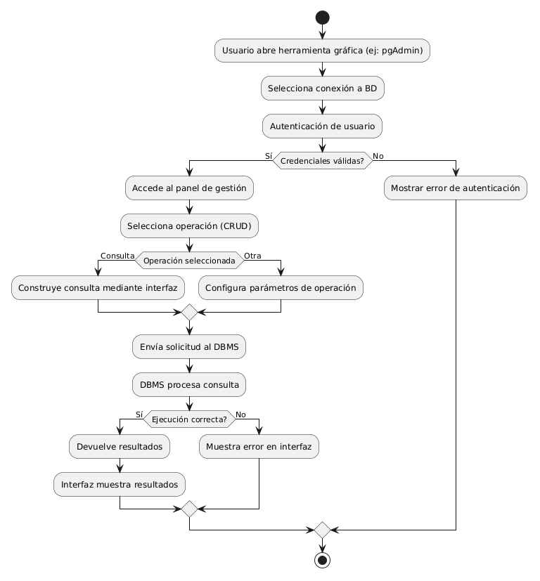

## Diagrama del Proceso Propuesto – Diagrama de actividades Inicial

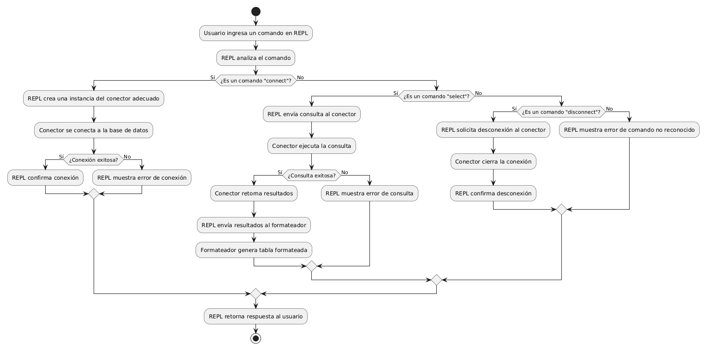

# Especificación de Requerimientos de Software

## Cuadro de Requerimientos funcionales Inicial

## Cuadro de Requerimientos No funcionales

## Cuadro de Requerimientos funcionales Final

## Reglas de Negocio

Para utilizar el sistema, el usuario debe tener instalado previamente al menos un motor de base de datos compatible, ya que la herramienta no incluye ningún gestor propio. La aplicación actúa únicamente como interfaz de conexión y administración.

El usuario debe conocer las credenciales de acceso a la base de datos que desea administrar, ya que el sistema no las almacena ni las recuerda entre sesiones. Cada vez que se inicie la aplicación, deberá conectarse manualmente.

Los comandos SQL y NoSQL ingresados deben respetar la sintaxis propia del motor de base de datos al que se está conectado. El sistema realiza una validación básica, pero la responsabilidad de escribir consultas correctas recae en el usuario.

La funcionalidad de exportación a CSV solo está disponible después de haber ejecutado una consulta SELECT. Si el usuario no ha realizado ninguna consulta, el comando export no tendrá efecto.

El sistema está diseñado para trabajar con una sola conexión a la vez. Si el usuario desea cambiar de base de datos, primero debe desconectarse y luego establecer una nueva conexión.

Al finalizar la sesión con el comando exit, cualquier conexión activa se cerrará automáticamente. Se recomienda al usuario verificar que ha guardado o exportado los resultados deseados antes de salir.

El comando help muestra únicamente los comandos disponibles según el modo de operación seleccionado al inicio. Si el usuario ingresó en modo relacional, no verá comandos específicos de bases de datos NoSQL, y viceversa.

Las contraseñas se ingresan en texto plano durante el comando connect. Por seguridad, se recomienda no utilizar el sistema en entornos donde la pantalla pueda ser visible para terceros.

El sistema está pensado para fines educativos y de práctica. No se recomienda su uso en entornos de producción con datos sensibles sin antes implementar medidas adicionales de seguridad.

Las integraciones externas (servidor MCP y bot de Telegram) únicamente permiten operaciones de lectura; cualquier intento de comando de escritura será rechazado automáticamente, independientemente del cliente que lo origine.

# Fase de Desarrollo

## Perfiles de Usuario

Usuario Básico (Estudiante): Estudiante de cursos introductorios de bases de datos que requiere practicar comandos SQL fundamentales. Conocimientos requeridos: conexión a bases de datos, comandos SELECT, INSERT, UPDATE, DELETE básicos. Interacción típica: sesiones de laboratorio 1-2 veces por semana, utiliza frecuentemente el comando help.

Usuario Intermedio (Desarrollador): Desarrollador o estudiante avanzado que realiza consultas complejas y administración de estructuras. Conocimientos requeridos: SQL avanzado (joins, subconsultas), DDL, conocimiento de múltiples SGBD. Interacción típica: uso varias veces por semana, ejecuta operaciones CRUD completas y gestiona tablas.

Usuario Técnico (Administrador): Administrador de bases de datos o docente que utiliza todas las funcionalidades del sistema. Conocimientos requeridos: administración de SGBD, optimización de consultas, conocimiento de motores relacionales y NoSQL. Interacción típica: uso diario, aprovecha funcionalidades completas, exporta resultados y trabaja con múltiples motores.

## Modelo Conceptual

### Diagrama de Paquetes

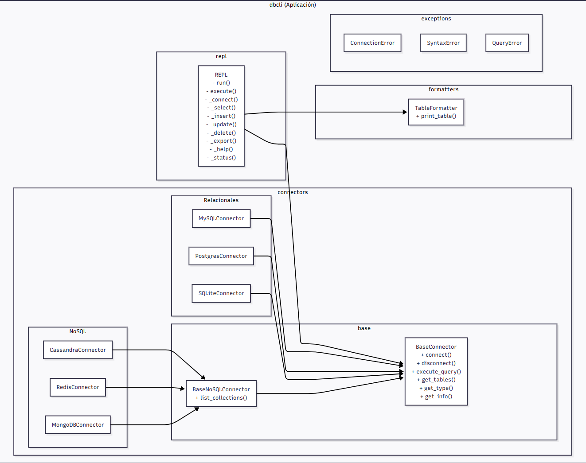

### Diagrama de Casos de Uso

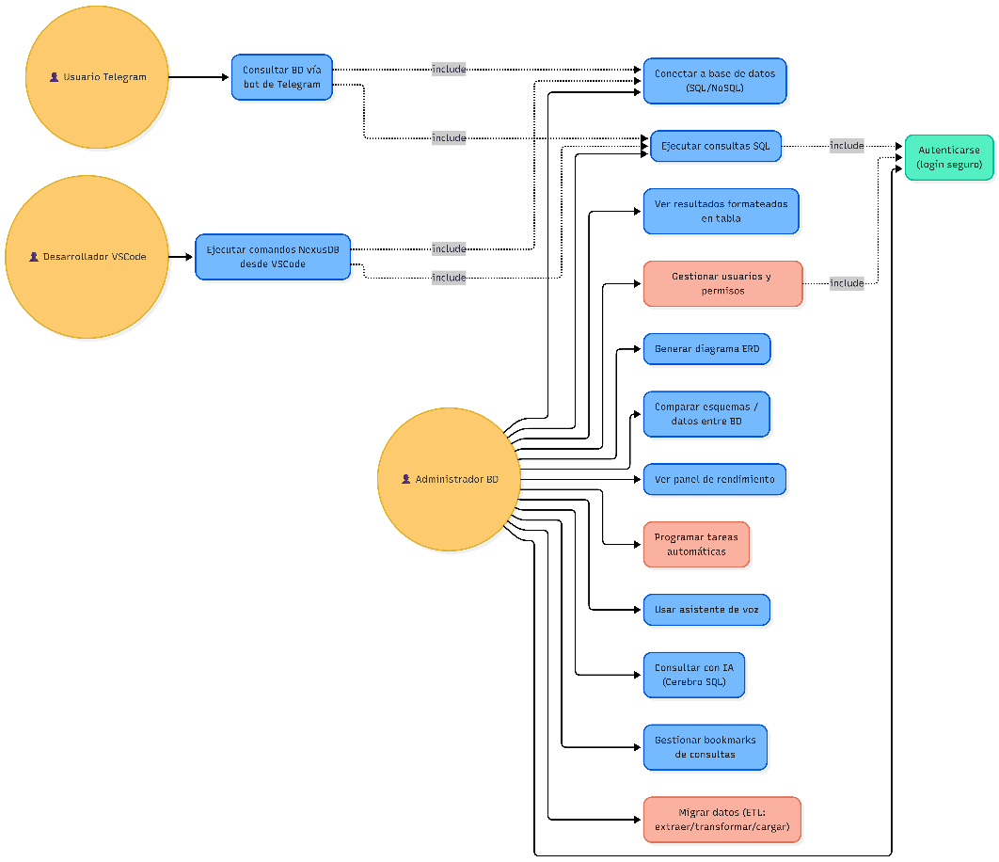

### Escenarios de Caso de Uso (narrativa)

## Modelo Logico

### Diagrama de Secuencia

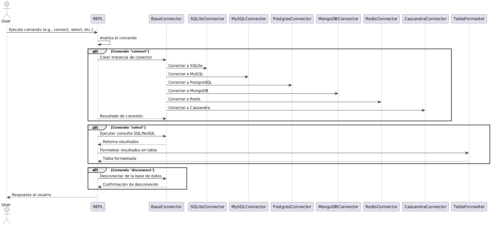

### Diagrama de Clases

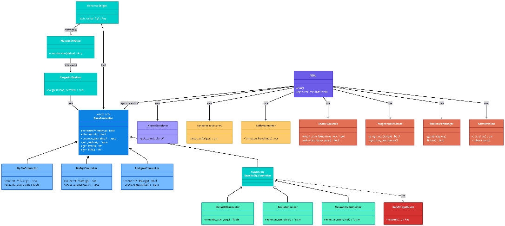

# CONCLUSIONES

- El proyecto permitió desarrollar un sistema funcional de administración de bases de datos en consola, capaz de ejecutar operaciones básicas sobre gestores como MySQL, PostgreSQL o SQLite.

# RECOMENDACIONES

Realizar pruebas con cada uno de los tres motores de base de datos soportados antes de la presentación.

Preparar un script de demostración que muestre una conexión exitosa, una consulta SELECT con varias filas y un ejemplo de manejo de errores.

Verificar que la terminal utilizada durante la presentación soporte caracteres Unicode para que las tablas se muestren correctamente.

Incluir instrucciones claras de instalación y uso en un archivo README.

Para versiones futuras, implementar enmascaramiento de contraseñas usando el módulo getpass de Python.

# BIBLIOGRAFIA

Ramakrishnan, R., & Gehrke, J. (2003). Sistemas de Gestión de Bases de Datos (3ª ed.). McGraw-Hill.

Silberschatz, A., Korth, H. F., & Sudarshan, S. (2019). Database System Concepts (7ª ed.). McGraw-Hill Education.

Beaulieu, A. (2020). Learning SQL (3ª ed.). O'Reilly Media.

Python Software Foundation. (2026). The Python Standard Library.

# WEBGRAFIA

Python.org. (2026). *Python 3.8+ Documentation*. Recuperado de https://docs.python.org/3/

PostgreSQL Global Development Group. (2026). PostgreSQL Documentation. Recuperado de https://www.postgresql.org/docs/

Oracle Corporation. (2026). MySQL Documentation. Recuperado de https://dev.mysql.com/doc/

SQLite Consortium. (2026). SQLite Documentation. Recuperado de https://www.sqlite.org/docs.html

## Anexos (imágenes adicionales del documento original)

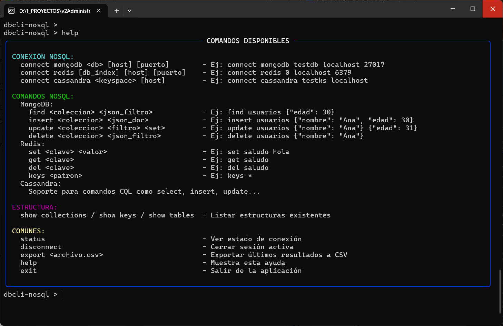

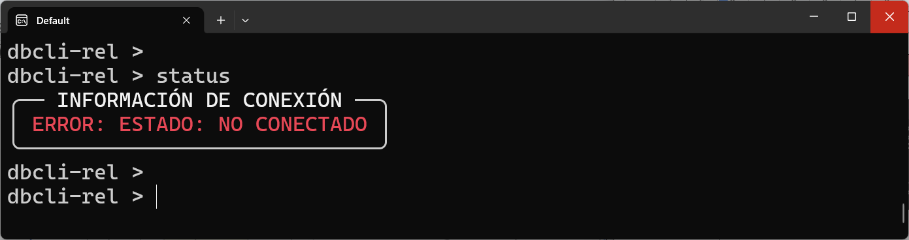

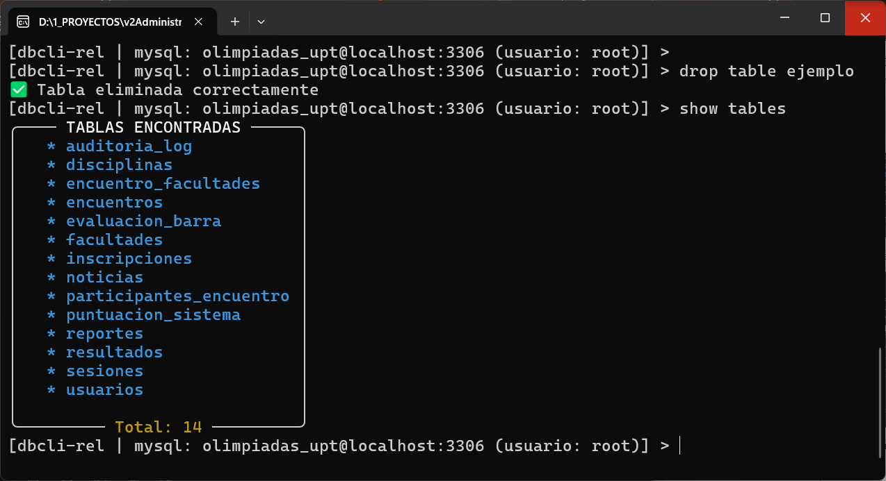

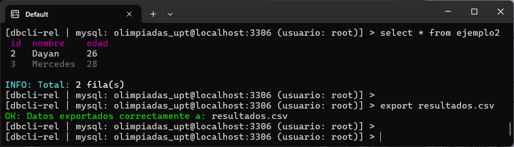

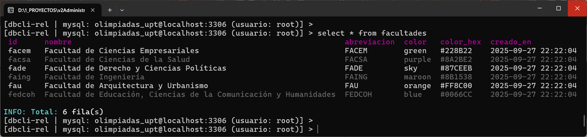

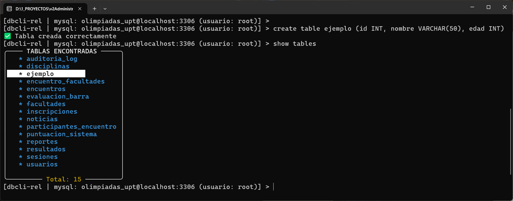

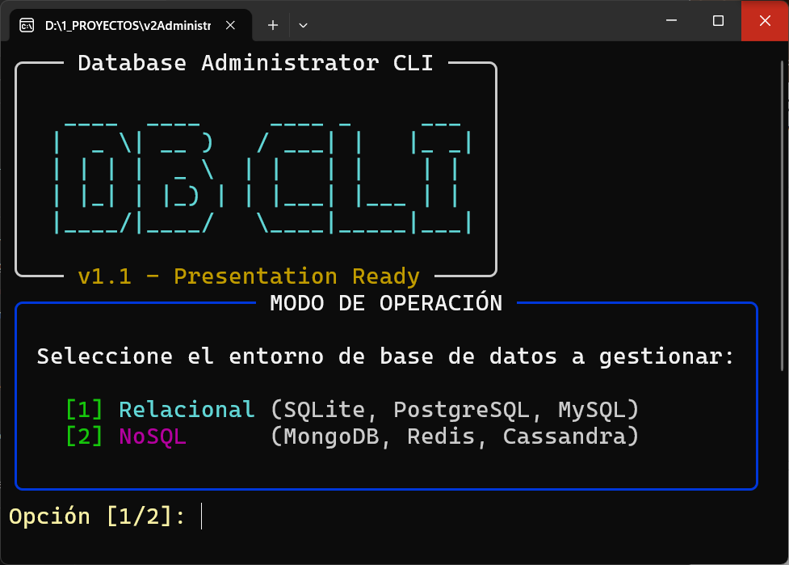

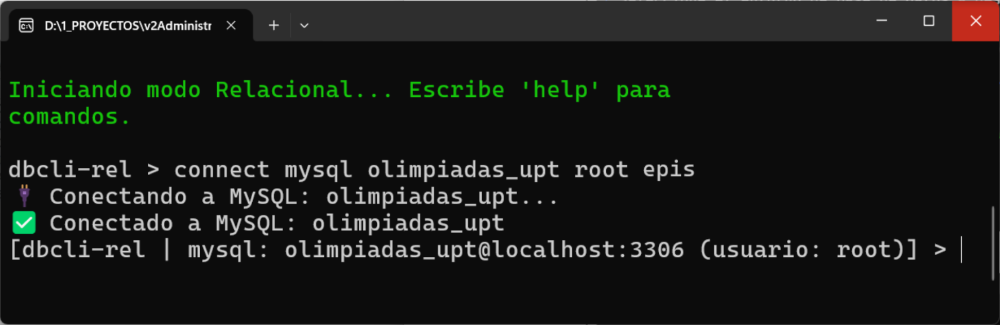

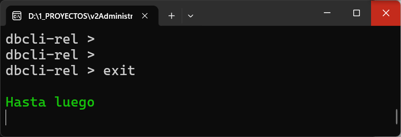

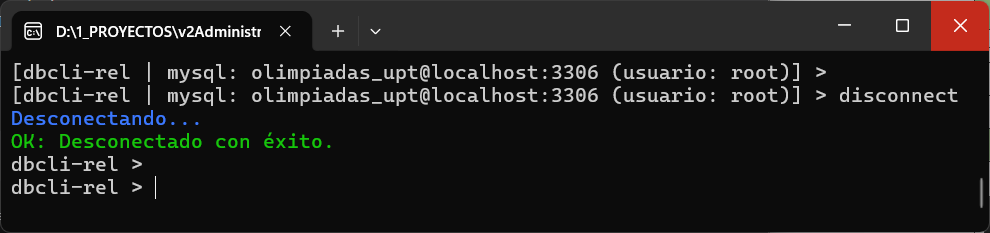

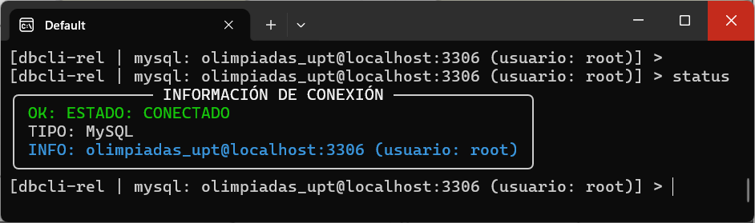

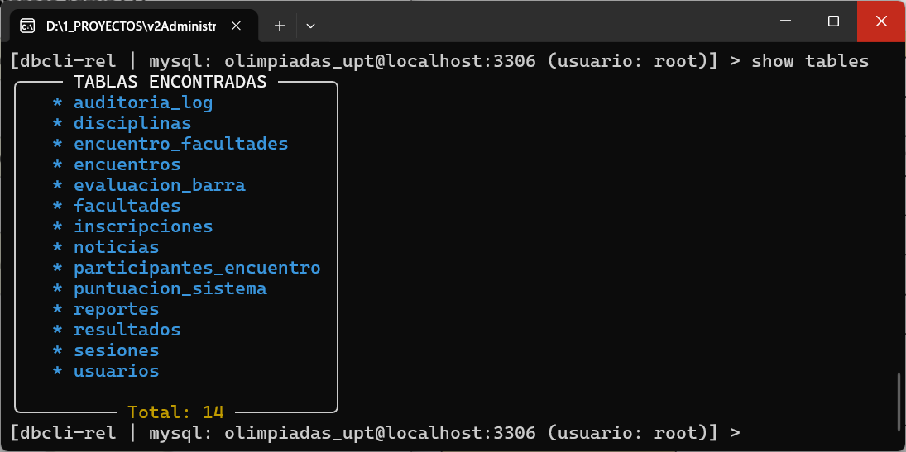

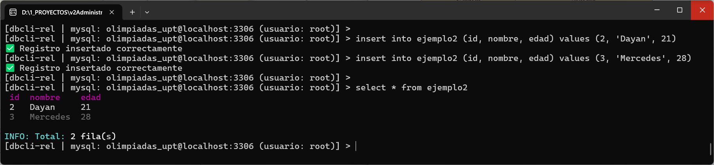

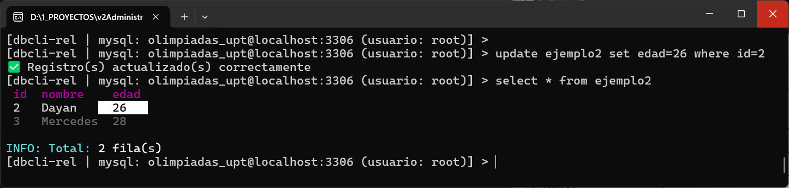

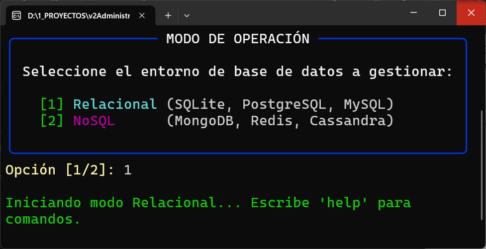

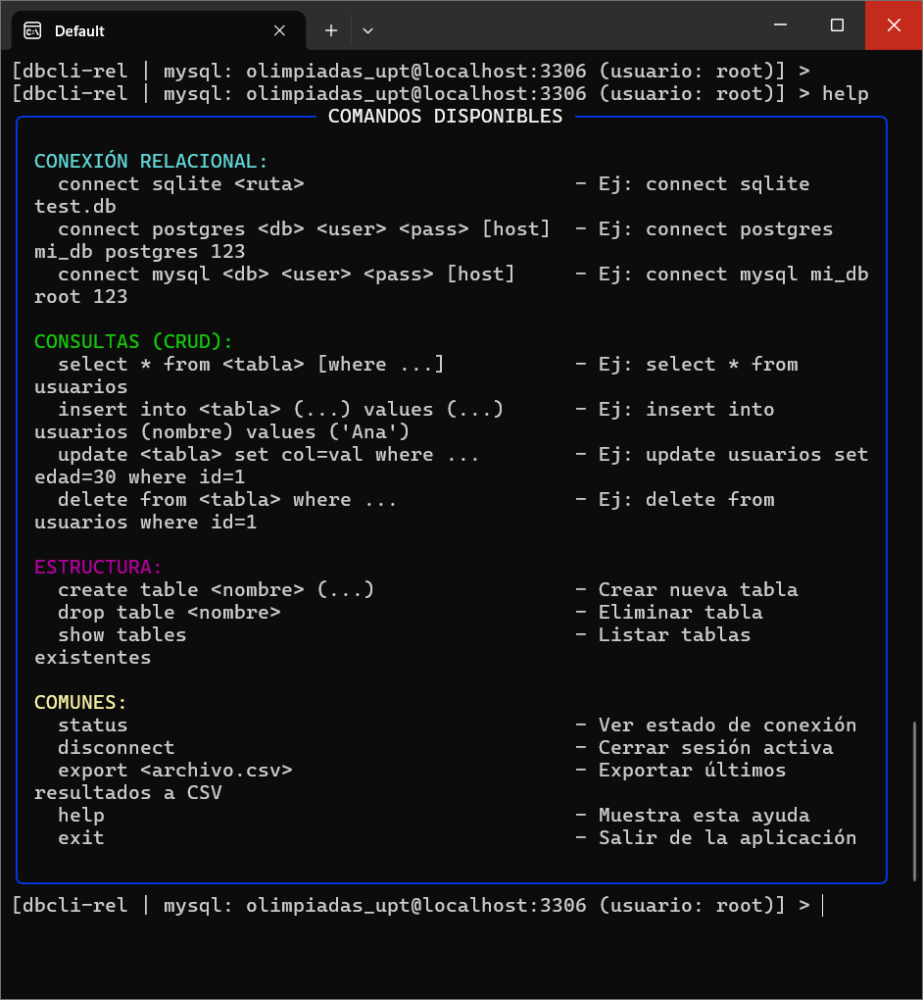
