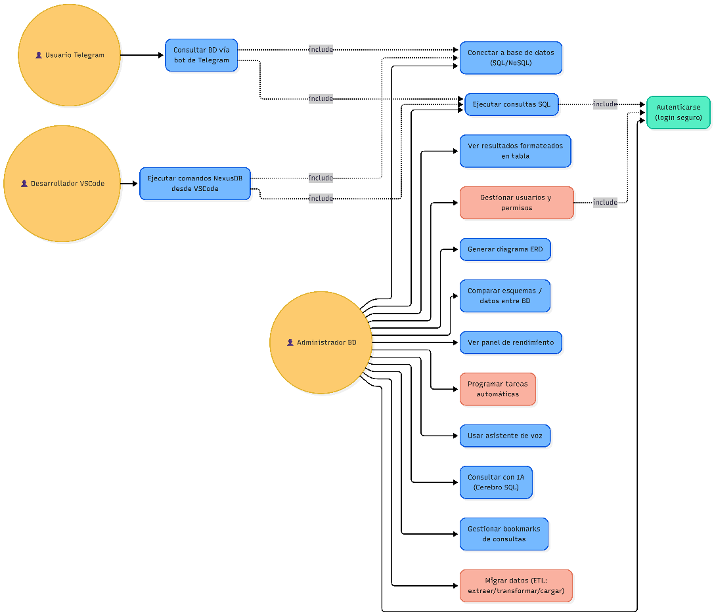
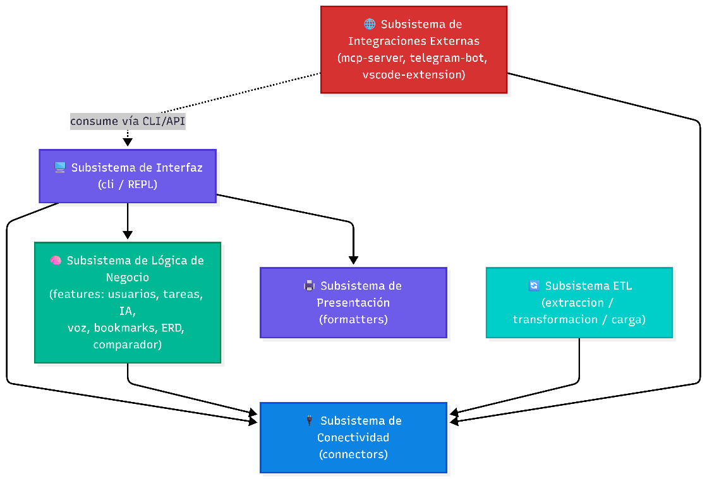
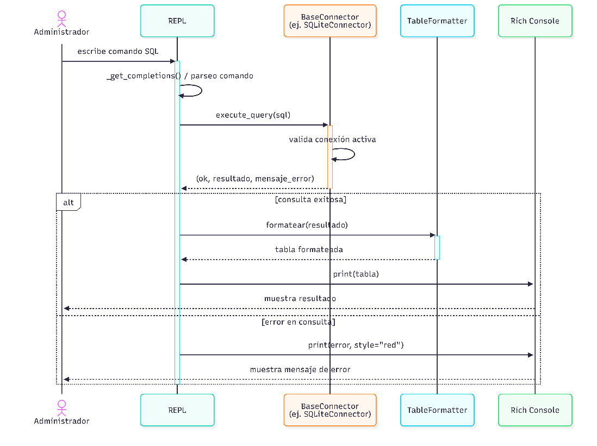
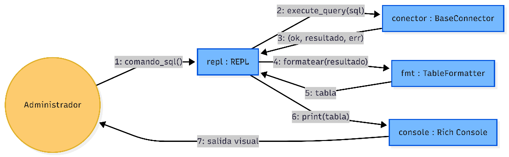
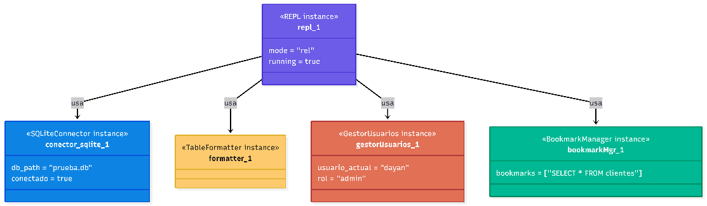
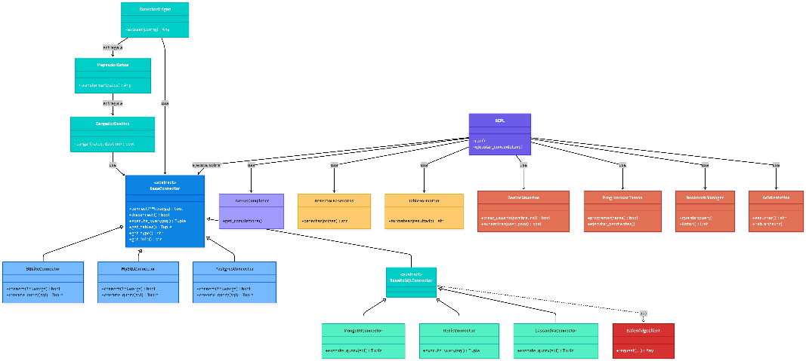
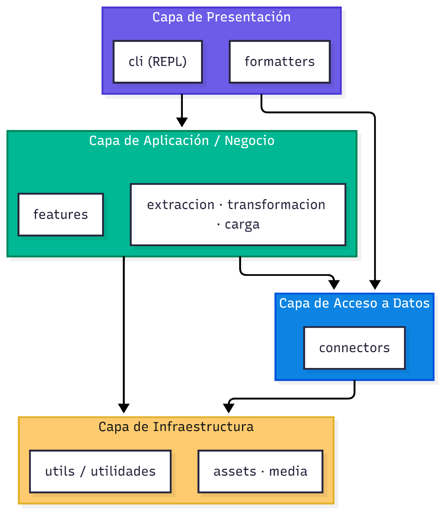
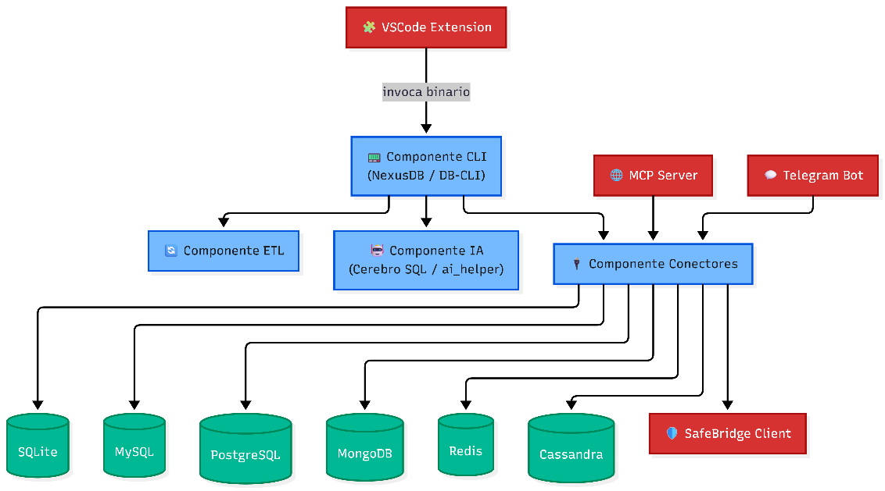
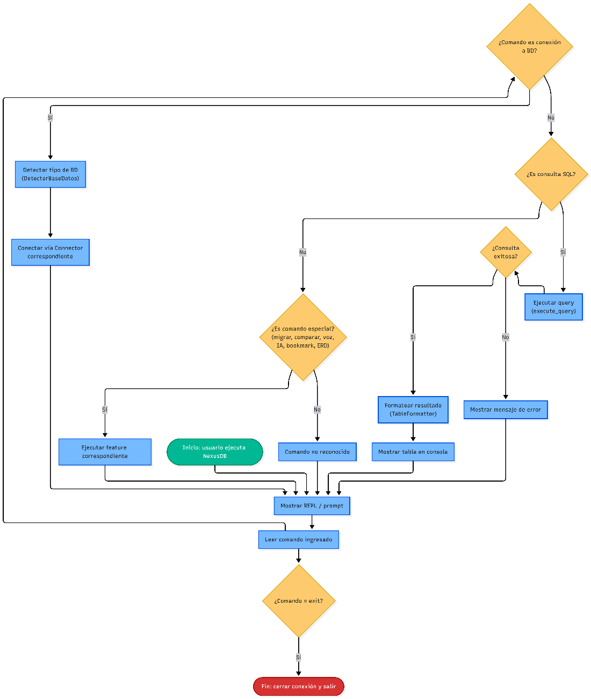
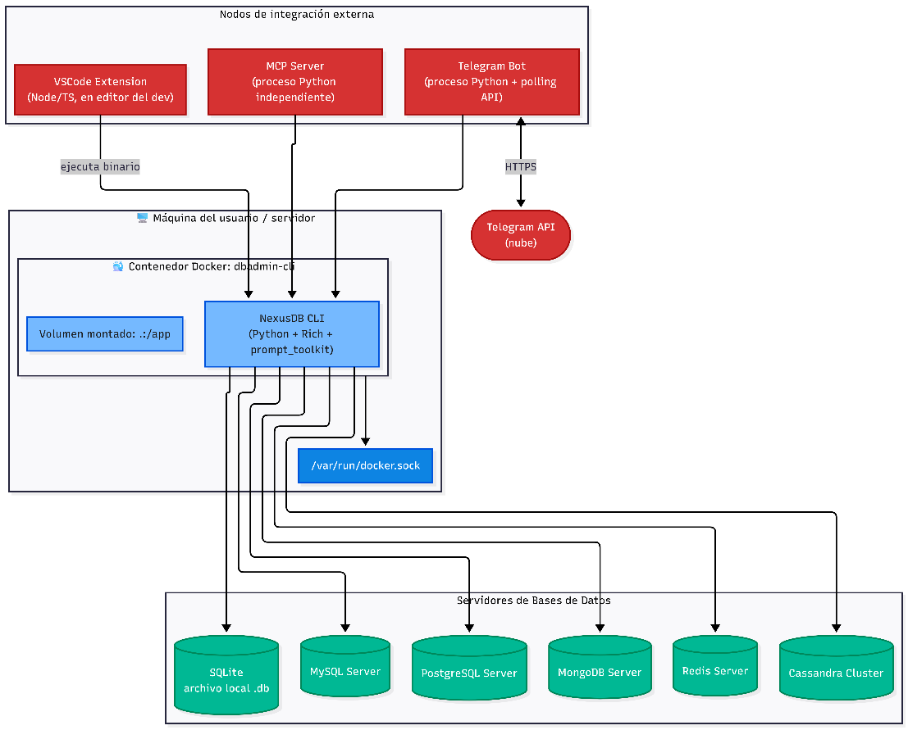

UNIVERSIDAD PRIVADA DE TACNA

FACULTAD DE INGENIERÍA

Escuela Profesional de Ingeniería de Sistemas

Proyecto Administrador de BD en consola o termina

Curso: Base de Datos II

Docente: Patrick Cuadros Quiroga

Integrantes:

Jahuira Pilco, Dayan Elvis					(2022075749)

Mamani Cori, Cristhian Carlos				(2023077282)

Tacna – Perú

2026

| CONTROL DE VERSIONES | CONTROL DE VERSIONES | CONTROL DE VERSIONES | CONTROL DE VERSIONES | CONTROL DE VERSIONES | CONTROL DE VERSIONES |
| --- | --- | --- | --- | --- | --- |
| Versión | Hecha por | Revisada por | Aprobada por | Fecha | Motivo |
| 1.0 | DJ - CM | PCQ | PCQ | 26/04/2026 | Versión Original |
| 2.0 | DJ - CM | PCQ | PCQ | 06/06/2026 | Versión 2.0 |
| 3.0 | DJ - CM | PCQ | PCQ | 06/07/2026 | Versión Final |

# Sistema Administrador de BD en consola o termina

# Documento de Arquitectura de Software

# Versión 3.0

| CONTROL DE VERSIONES | CONTROL DE VERSIONES | CONTROL DE VERSIONES | CONTROL DE VERSIONES | CONTROL DE VERSIONES | CONTROL DE VERSIONES |
| --- | --- | --- | --- | --- | --- |
| Versión | Hecha por | Revisada por | Aprobada por | Fecha | Motivo |
| 1.0 | DJ - CM | PCQ | PCQ | 26/04/2026 | Versión Original |
| 2.0 | DJ - CM | PCQ | PCQ | 06/06/2026 | Versión 2.0 |
| 3.0 | DJ - CM | PCQ | PCQ | 06/07/2026 | Versión Final |

INDICE GENERAL

Contenido

# INTRODUCCIÓN

## Propósito (Diagrama 4+1)

El presente documento tiene como propósito definir la arquitectura de software del sistema "Administrador de BD en consola o terminal" utilizando el modelo de vistas 4+1 (Lógica, Implementación, Procesos, Despliegue y Casos de Uso). Presenta una visión global del diseño, justificando cómo las decisiones arquitectónicas satisfacen los requerimientos funcionales de administración de bases de datos y las prioridades de modularidad, extensibilidad y facilidad de uso en entornos de consola.

## Alcance

Este documento se centra en el desarrollo de la arquitectura del sistema CLI en Python, su estructura modular de conectores (relacionales y NoSQL) y el formateo de resultados. Incluye la vista lógica (conectores y REPL), la vista de implementación (paquetes y componentes) y la vista de procesos (flujo de ejecución de comandos). Adicionalmente, cubre la arquitectura de las tres integraciones de distribución del sistema: la extensión de Visual Studio Code, el servidor MCP (Model Context Protocol) y el bot de Telegram, todos reutilizando la misma capa de conectores del CLI. Se omiten procesos de interfaz gráfica ya que el sistema opera completamente en consola.

## Definición, siglas y abreviaturas

CLI: Interfaz de Línea de Comandos (Command Line Interface).

REPL: Bucle de Lectura-Evaluación-Impresión (Read-Eval-Print Loop).

CRUD: Operaciones de Crear, Leer, Actualizar y Eliminar (Create, Read, Update, Delete).

SGBD: Sistema Gestor de Bases de Datos.

SQL: Lenguaje de Consulta Estructurado (Structured Query Language).

NoSQL: Bases de datos no relacionales (Not Only SQL).

CSV: Valores Separados por Comas (Comma-Separated Values).

DDL: Lenguaje de Definición de Datos (Data Definition Language).

DML: Lenguaje de Manipulación de Datos (Data Manipulation Language).

## Organización del documento

El documento está organizado en cuatro secciones principales: Objetivos y restricciones (define qué se debe cumplir), Representación de la arquitectura (donde se exponen los diagramas 4+1), y finalmente los atributos de calidad del software.

# OBJETIVOS Y RESTRICCIONES ARQUITECTONICAS

## Priorización de requerimientos

### Requerimientos Funcionales

### No Funcionales – Atributos de Calidad

## Restricciones

El desarrollo debe utilizar estrictamente Python 3.8 o superior. Las librerías externas permitidas son únicamente aquellas necesarias para la conexión a cada motor de base de datos (relacional y NoSQL), la librería Rich para el formateo de tablas en consola, y las librerías oficiales de las integraciones externas (mcp, python-telegram-bot). La interfaz principal debe ser exclusivamente mediante línea de comandos, sin componentes gráficos. El sistema no debe incluir un motor de base de datos propio, actuando únicamente como intermediario entre el usuario y el SGBD. Las herramientas expuestas al servidor MCP y al bot de Telegram deben restringirse a operaciones de solo lectura.

# REPRESENTACIÓN DE LA ARQUITECTURA DEL SISTEMA

## Vista de Caso de uso

### Diagramas de Casos de uso

## Vista Lógica

### Diagrama de Subsistemas (paquetes)

### Diagrama de Secuencia (vista de diseño)

### Diagrama de Colaboración (vista de diseño)

### Diagrama de Objetos

### Diagrama de Clases

### Diagrama de Base de datos (relacional o no relacional)

El sistema Administrador de BD en consola o terminal no cuenta con una base de datos propia, ya que su función es actuar como interfaz entre el usuario y los motores de base de datos externos. La arquitectura del sistema está diseñada para conectarse a bases de datos ya existentes sin requerir un esquema de almacenamiento interno.

El único dato que el sistema mantiene en memoria durante la sesión es el resultado de la última consulta SELECT ejecutada, el cual se almacena en la variable last_results para permitir su exportación a CSV. Esta información es volátil y se descarta al cerrar el programa o al ejecutar una nueva consulta.

## Vista de Implementación (vista de desarrollo)

### Diagrama de arquitectura software (paquetes)

### Diagrama de arquitectura del sistema (Diagrama de componentes)

## Vista de procesos

### Diagrama de Procesos del sistema (diagrama de actividad)

## Vista de Despliegue (vista física)

### Diagrama de despliegue

Además del despliegue local del CLI, el sistema se distribuye en tres entornos adicionales: la extensión de Visual Studio Code (empaquetada con el ejecutable de NexusDB e instalada desde el Marketplace), el servidor MCP (publicado como paquete Python en PyPI e invocado bajo demanda por el cliente de IA) y el bot de Telegram (desplegado de forma permanente como servicio systemd en un VPS Debian, con reinicio automático ante fallos). Los tres canales reutilizan la misma capa de conectores, evitando duplicar la lógica de acceso a datos.

# ATRIBUTOS DE CALIDAD DEL SOFTWARE.

Escenario de Funcionalidad

El sistema demuestra su funcionalidad al interpretar correctamente los comandos ingresados por el usuario, ejecutar las operaciones CRUD correspondientes sobre la base de datos conectada y mostrar los resultados en formato tabular. Ante comandos inválidos, el sistema muestra mensajes de error descriptivos sin finalizar la ejecución.

Escenario de Usabilidad

Al ser una herramienta de consola, la usabilidad se enfoca en la claridad de los comandos y la legibilidad de los resultados. Se garantiza mediante un comando help que muestra todos los comandos disponibles organizados por categoría, mensajes con indicadores visuales de éxito o error, y resultados presentados en tablas con bordes y estilos.

Escenario de confiabilidad

El sistema previene fallos catastróficos mediante el manejo estructurado de excepciones. Cualquier error de sintaxis SQL, conexión o ejecución es capturado y mostrado al usuario sin que el programa colapse. Las credenciales no se almacenan en archivos ni logs, y las conexiones se cierran explícitamente al desconectar o salir.

Escenario de rendimiento

El bucle REPL y los conectores están diseñados para ejecutar consultas simples en tiempos inferiores a un segundo. El formateo de resultados mediante Rich es eficiente incluso para conjuntos de datos moderados, y la exportación a CSV se realiza de manera inmediata sobre los resultados almacenados en memoria.

Escenario de mantenibilidad

La arquitectura separada en capas (REPL, Conectores, Formateador) y el uso de una clase base abstracta facilitan la extensibilidad. Nuevos motores de base de datos pueden añadirse implementando un nuevo conector que herede de BaseConnector o BaseNoSQLConnector, sin necesidad de modificar la lógica del bucle principal ni del formateador.

